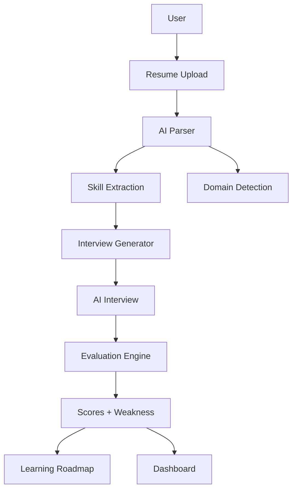

<div align="center">

# 🧠 NeuroPath AI

### AI-Powered Career Intelligence & Interview Simulation Platform

> Transforming resume data into actionable career insights using AI

</div>

---

## 🚀 Overview

**NeuroPath AI** is a full-stack AI platform that simulates a real-world hiring pipeline — from resume analysis to interview evaluation and personalized learning.

It helps users:

* Understand their career trajectory
* Identify skill gaps
* Practice high-level interviews
* Improve placement readiness with data-driven insights

---

## 🎯 Key Features

### 📄 Resume Intelligence Engine

* Extracts:

  * Skills
  * Projects
  * Experience
* Predicts:

  * Best domain
  * Top career paths
* Calculates:

  * Resume score
  * Skill gaps

---

### 🎤 AI Mock Interview System

* Generates **15 structured questions**:

  * 1 Introduction
  * 2 Soft skills
  * 8 Technical (skill-based)
  * 4 Project/Domain-based
* No repetition across sessions
* Difficulty: **core + advanced level**

---

### 📷 Proctoring System (OpenCV)

* Real-time webcam monitoring
* Detects:

  * Multiple persons
  * No face
  * Suspicious activity
* Ensures interview integrity

---

### 📊 Interview Evaluation Engine

* Scores:

  * Technical ability
  * Communication
  * Confidence
* Outputs:

  * Weakness analysis
  * Performance report

---

### 🛣️ Learning Roadmap System

#### For Technical Users:

* Personalized roadmap based on:

  * Weaknesses
  * Missing skills
* Includes:

  * Topics
  * Resources
  * Progress tracking

#### Daily Coding System:

* 2–3 problems daily
* Fullscreen mode (exit = terminate)
* Tracks:

  * Streak
  * Problems solved

---

#### For All Users (Aptitude System):

* 20 questions
* 30-minute timer
* Fullscreen strict mode
* Tracks:

  * Score
  * Accuracy

---

### 📈 Dashboard System

* Resume Score
* Interview Score
* Confidence Level
* Aptitude Score
* Coding Streak
* Learning Progress

---

## 🧠 System Architecture



---

## 🛠️ Tech Stack

### Frontend

* React (Vite)
* Context API (State Management)
* Modern CSS (Glassmorphism UI)

### Backend

* FastAPI
* REST APIs
* Modular architecture

### AI / ML

* NLP-based resume parsing
* Skill matching logic
* Rule-based + ML hybrid evaluation

### Computer Vision

* OpenCV (Face Detection & Proctoring)

### Database

* SQLite / MySQL

---

## ⚡ Unique Highlights

* Real-world hiring pipeline simulation
* Strict fullscreen interview & test environment
* Skill-based dynamic interview generation
* Integrated coding + aptitude system
* End-to-end data flow (Resume → Interview → Roadmap → Dashboard)

---

## 📂 Project Structure

```
NeuroPath_AI/
│
├── frontend/
│   ├── src/pages/
│   ├── src/context/
│   ├── src/api/
│
├── backend/
│   ├── app/ml/
│   ├── app/routes/
│   ├── app/proctoring/
│
└── README.md
```

---

## ▶️ Running Locally

### Backend

```
cd backend
uvicorn app.main:app --reload --port 8001
```

### Frontend

```
cd frontend
npm install
npm run dev
```

---

## 📌 Future Improvements

* LLM-based answer evaluation
* Real-time voice emotion analysis
* Adaptive interview difficulty
* Deployment (AWS / Docker)

---

## 👤 Author

**Animesh Sahoo**

* GitHub: https://github.com/animesh6532
* Project: NeuroPath AI

---

## ⭐ Final Note

This project is designed to replicate a **real hiring system using AI** — combining resume intelligence, interview simulation, and learning guidance into one unified platform.
