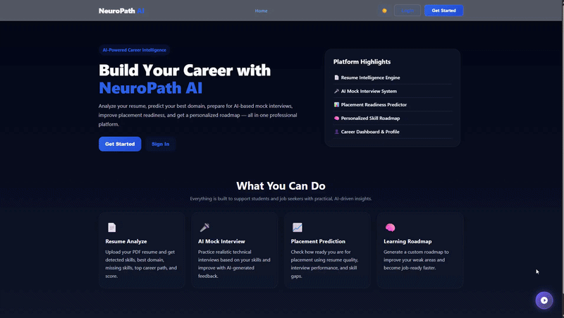
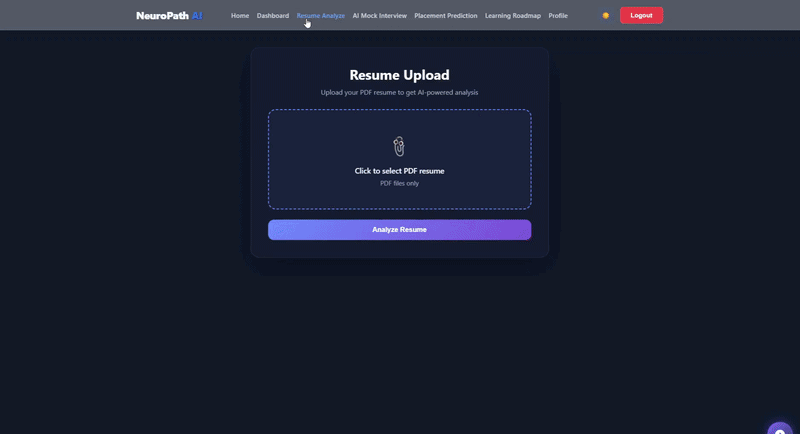
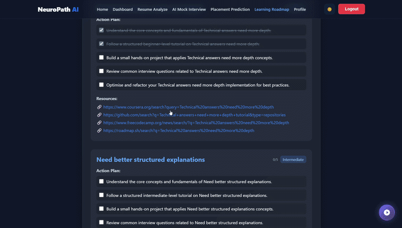
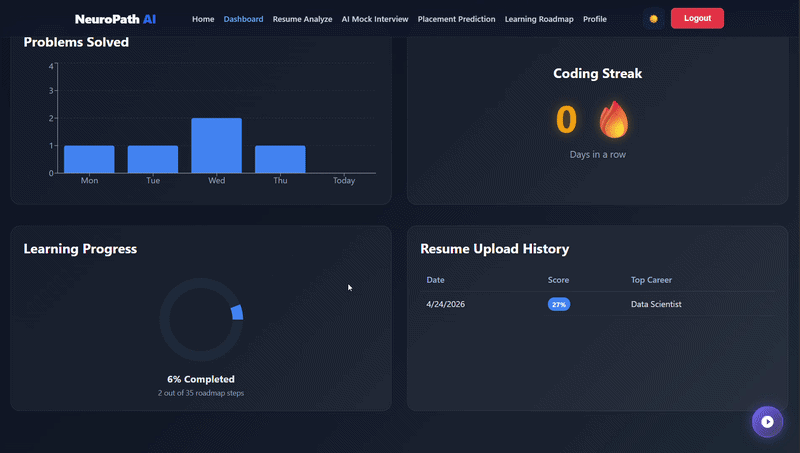
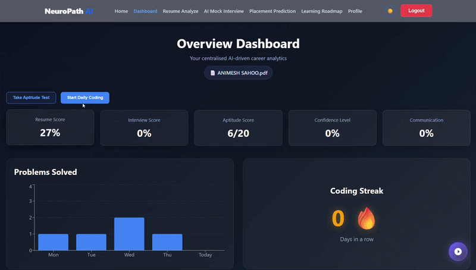
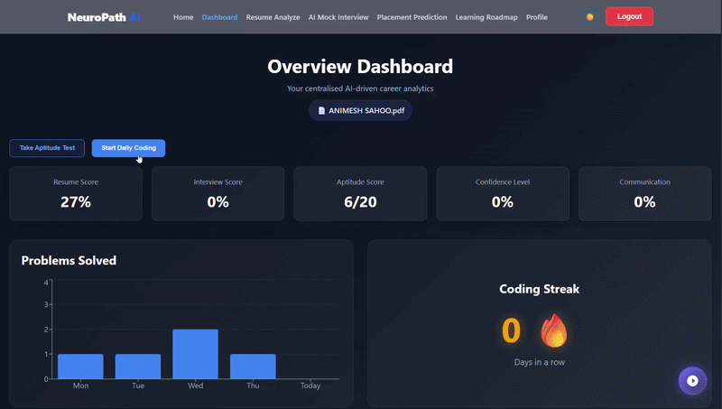
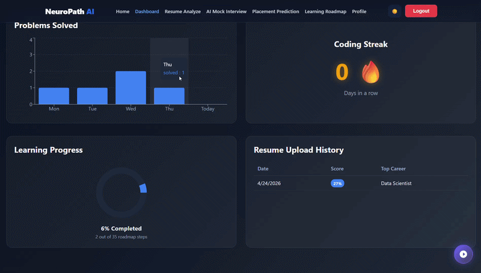
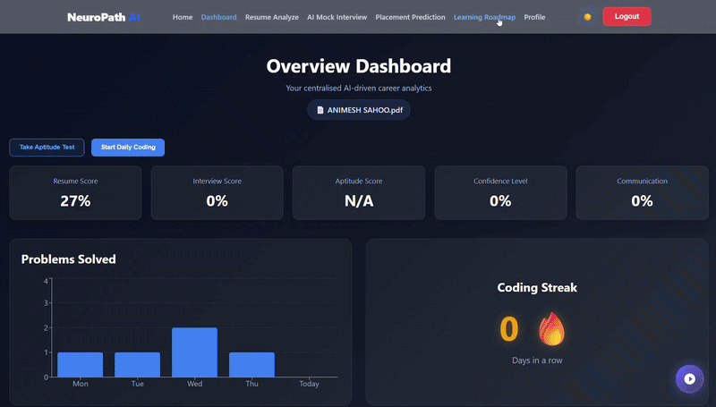
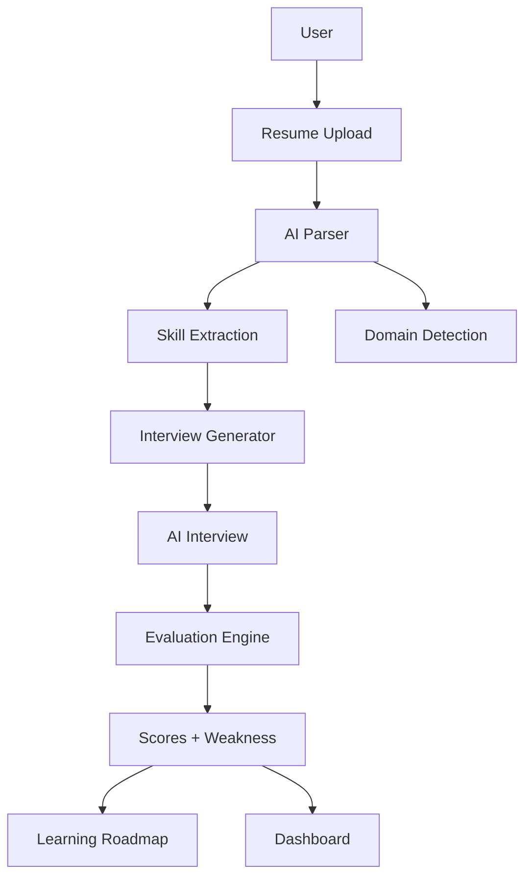

<div align="center">

# 🧠 NeuroPath AI

### AI-Powered Career Intelligence & Interview Simulation Platform

> Transforming resume data into actionable career insights using AI

</div>

---

## 🚀 Overview

**NeuroPath AI** is a full-stack AI platform that simulates a real-world hiring pipeline — from resume analysis to interview evaluation and personalized learning.

It helps users:

* Understand their career trajectory
* Identify skill gaps
* Practice high-level interviews
* Improve placement readiness with data-driven insights

---

## 🎯 Key Features

---

### 🏠 Landing Page & Authentication

<p align="center">
  
</p>

* Modern AI SaaS landing experience designed for clarity and engagement
* Smooth onboarding with secure authentication system (Login / Register)
* Responsive UI with clean navigation and intuitive user flow
* Built to reflect a real-world product-level interface, not a basic project

---

### 📄 Resume Intelligence Engine

<p align="center">
  
</p>

* Automatically extracts:
  * Technical skills
  * Projects and achievements
  * Work experience
* Uses intelligent matching to:
  * Identify best-fit domain
  * Recommend top career paths
* Generates:
  * Resume score based on industry standards
  * Missing skills analysis for improvement
* Helps users understand exactly **where they stand and what to improve**

---

### 🎤 AI Mock Interview System

<p align="center">
  
</p>

* Dynamically generates **15 structured interview questions**:
  * 1 Introduction (HR-style)
  * 2 Soft skill questions
  * 8 Deep technical questions (based on user skills)
  * 4 Project/domain-based questions
* Ensures:
  * No repetition across sessions
  * High difficulty (core + advanced level)
* Simulates a **real technical interview environment**

#### 🔒 Strict Mode (Proctoring)

<p align="center">
  
</p>

* Real-time webcam monitoring using computer vision
* Detects:
  * No face presence
  * Multiple persons
  * Suspicious movement
* Enforces discipline similar to real interview conditions
* Prevents cheating and ensures authenticity

#### 📊 Interview Result

<p align="center">
  
</p>

* Evaluates performance across:
  * Technical knowledge
  * Communication clarity
  * Confidence level
* Provides:
  * Weakness analysis
  * Improvement suggestions
  * Structured performance report
* Helps users understand **how they perform in real interviews**

---

### 🛣️ Learning Roadmap System

<p align="center">
  
</p>


* Generates a **personalized learning roadmap** based on:
  * Interview weaknesses
  * Missing skills from resume analysis
* Includes:
  * Step-by-step learning path
  * Curated learning resources (videos, docs, articles)
  * Difficulty progression
* Focuses on **targeted improvement instead of generic learning**
* Tracks progress and helps users move toward job readiness systematically

---

### 📈 Placement Prediction

<p align="center">
  
</p>

* Predicts placement readiness using:
  * Resume quality
  * Interview performance
  * Skill gap analysis
* Suggests:
  * Suitable job roles
  * Domain alignment
* Integrates opportunity discovery:
  * Direct job/internship links (LinkedIn, Internshala, etc.)
* Bridges the gap between **preparation and actual hiring opportunities**

---

### 💻 Daily Coding Challenge

<p align="center">
  
</p>

* Provides **2–3 curated coding problems daily**
* Covers:
  * Data Structures & Algorithms
  * Real interview-level questions
* Tracks:
  * Daily streak
  * Problems solved
  * Progress over time
* Encourages consistency and builds problem-solving skills

#### 🔒 Strict Mode

<p align="center">
  
</p>

* Fullscreen enforced coding environment
* Exit detection → session termination
* Simulates real coding test conditions
* Prevents distractions and ensures focus

---

### 🧠 Aptitude Exam System

<p align="center">
  
</p>

* Standardized aptitude test:
  * 20 questions
  * Logical reasoning, quantitative, analytical
* Time-bound:
  * 30-minute exam environment
* Designed for both technical and non-technical users

#### 🔒 Strict Mode

<p align="center">
  
</p>

* Fullscreen exam enforcement
* Auto-submit on:
  * Tab switch
  * Exit
* Ensures exam integrity similar to real assessments

---

### 👤 Profile & Dashboard

<p align="center">
  
</p>

* Centralized performance dashboard displaying:
  * Resume score
  * Interview score
  * Confidence level
  * Coding streak
  * Aptitude results
* Personalized insights based on user journey
* Tracks overall progress across all modules
* Acts as a **career control center for the user**

---
## 🧠 System Architecture



---

## 🛠️ Tech Stack

### Frontend

* React (Vite)
* Context API (State Management)
* Modern CSS (Glassmorphism UI)

### Backend

* FastAPI
* REST APIs
* Modular architecture

### AI / ML

* NLP-based resume parsing
* Skill matching logic
* Rule-based + ML hybrid evaluation

### Computer Vision

* OpenCV (Face Detection & Proctoring)

### Database

* SQLite / MySQL

---

## ⚡ Unique Highlights

* Real-world hiring pipeline simulation
* Strict fullscreen interview & test environment
* Skill-based dynamic interview generation
* Integrated coding + aptitude system
* End-to-end data flow (Resume → Interview → Roadmap → Dashboard)

---

## 📂 Project Structure

```
NeuroPath_AI/
│
├── frontend/
│   ├── src/pages/
│   ├── src/context/
│   ├── src/api/
│
├── backend/
│   ├── app/ml/
│   ├── app/routes/
│   ├── app/proctoring/
│
└── README.md
```

---

## ▶️ Running Locally

### Backend

```
cd backend
uvicorn app.main:app --reload --port 8001
```

### Frontend

```
cd frontend
npm install
npm run dev
```

---

## 📌 Future Improvements

* LLM-based answer evaluation
* Real-time voice emotion analysis
* Adaptive interview difficulty
* Deployment (AWS / Docker)

---

## 👤 Author

**Animesh Sahoo**

* GitHub: https://github.com/animesh6532

---

## ⭐ Final Note

This project is designed to replicate a **real hiring system using AI** — combining resume intelligence, interview simulation, and learning guidance into one unified platform.
