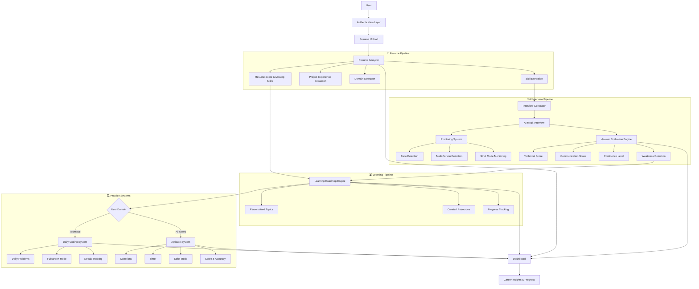

<div align="center">

# 🧠 NeuroPath AI

### AI-Powered Career Intelligence & Interview Simulation Platform

[](https://react.dev/)
[](https://fastapi.tiangolo.com/)
[]()
[]()
[](https://opencv.org/)

> **Transforming resume data into actionable career insights using artificial intelligence — an end-to-end hiring pipeline simulation that bridges the gap between preparation and placement.**

</div>

---

## 📑 Table of Contents

- [Overview](#-overview)
- [Why This Project Stands Out](#-why-this-project-stands-out)
- [Key Features](#-key-features)
  - [Landing Page & Authentication](#-landing-page--authentication)
  - [Resume Intelligence Engine](#-resume-intelligence-engine)
  - [AI Mock Interview System](#-ai-mock-interview-system)
  - [Learning Roadmap System](#-learning-roadmap-system)
  - [Placement Prediction](#-placement-prediction)
  - [Daily Coding Challenge](#-daily-coding-challenge)
  - [Aptitude Exam System](#-aptitude-exam-system)
  - [Profile & Dashboard](#-profile--dashboard)
- [System Architecture](#-system-architecture)
- [Tech Stack](#-tech-stack)
- [Project Structure](#-project-structure)
- [Running Locally](#-running-locally)
- [Future Improvements](#-future-improvements)
- [Real-World Impact](#-real-world-impact)
- [Author](#-author)

---

## 🚀 Overview

**The Problem:** Every year, millions of students and professionals struggle to crack technical interviews, not because they lack potential, but because they lack structured feedback, realistic practice environments, and data-driven guidance on where to improve.

**The Solution:** **NeuroPath AI** is a full-stack, AI-powered career intelligence platform that replicates an entire real-world hiring pipeline — from resume ingestion and skill analysis to proctored AI interviews, personalized learning roadmaps, and placement readiness prediction.

**The Impact:** Users don't just practice interviews — they receive institutional-grade feedback on their technical depth, communication clarity, and confidence levels, then get a hyper-personalized learning plan to close their gaps. It turns passive job-seeking into an active, measurable, and optimizable process.

---

## 🏆 Why This Project Stands Out

| Achievement | Detail |
|-------------|--------|
| **End-to-End Hiring Pipeline** | Unlike isolated tools, NeuroPath AI simulates the complete journey: Resume → Interview → Evaluation → Learning → Placement. |
| **AI-Driven Personalization** | Every interview question, coding problem, and roadmap recommendation is dynamically generated based on the user's actual resume and skill profile. |
| **Real-Time Proctoring with Computer Vision** | Built-in OpenCV-based face monitoring enforces exam integrity — detecting absence, multiple faces, and suspicious behavior in real time. |
| **Multi-Modal Evaluation Engine** | Evaluates candidates on technical accuracy, communication clarity, and confidence scoring — mirroring how FAANG recruiters assess talent. |
| **Strict Mode Simulation** | Fullscreen lock, tab-switch detection, and auto-termination replicate the high-pressure conditions of real online assessments. |
| **Data-Driven Placement Prediction** | Integrates resume quality, interview performance, and skill-gap analysis to predict placement readiness and recommend exact job roles. |

---

## 🎯 Key Features

---

### 🏠 Landing Page & Authentication

<p align="center">
  
</p>

<p align="center"><i>Modern AI SaaS landing experience designed for clarity, engagement, and instant value communication.</i></p>

- **Product-Grade Onboarding:** A polished, responsive landing page that establishes trust and communicates platform value within seconds — built to the standard of commercial SaaS products, not student projects.
- **Secure Authentication System:** JWT-based login and registration with protected route architecture, ensuring user data privacy and session integrity.
- **Responsive, Accessible UI:** Glassmorphism-inspired design with theme toggling, fluid navigation, and mobile-ready layouts that work across devices.

---

### 📄 Resume Intelligence Engine

<p align="center">
  
</p>

<p align="center"><i>Intelligent resume parsing that extracts skills, projects, and experience — then tells you exactly where you stand.</i></p>

- **Automated Information Extraction:** Uses NLP-based parsing to intelligently extract technical skills, project descriptions, work experience, and achievements from uploaded PDF resumes.
- **Domain Classification & Career Matching:** Matches extracted skills against comprehensive career databases to identify best-fit domains (e.g., Machine Learning, Full-Stack, Data Engineering) and recommend optimal career trajectories.
- **Resume Scoring & Gap Analysis:** Generates a quantitative resume score benchmarked against industry standards, paired with a detailed missing-skills report so users know precisely what to learn next.
- **Real-World Use Case:** A student uploads their resume and discovers they are 73% ready for a Backend Engineer role — but missing key skills in System Design and Cloud Deployment. The engine flags these gaps instantly.

---

### 🎤 AI Mock Interview System

<p align="center">
  
</p>

<p align="center"><i>Dynamic, skill-aware interview generation that adapts to your profile and simulates real technical interviews.</i></p>

- **Adaptive Question Generation:** Dynamically constructs **15 structured interview questions** per session:
  - 1 HR-style introduction question
  - 2 Soft-skill / behavioral questions
  - 8 Deep technical questions tailored to the user's extracted skills
  - 4 Project and domain-specific scenario questions
- **Session Uniqueness & Difficulty Calibration:** Ensures zero repetition across sessions and targets core-to-advanced difficulty levels — just like actual FAANG loop interviews.
- **Realistic Interview Environment:** Simulates pressure, structure, and pacing of live technical interviews to build genuine confidence.

#### 🔒 Strict Mode — AI Proctoring

<p align="center">
  
</p>

<p align="center"><i>Computer vision-powered proctoring that enforces discipline and ensures authentic interview conditions.</i></p>

- **Real-Time Webcam Monitoring:** OpenCV-powered face detection continuously monitors the candidate throughout the interview.
- **Behavioral Anomaly Detection:** Automatically flags:
  - Face absence (looking away / leaving seat)
  - Multiple person detection
  - Suspicious movement patterns
- **Interview Integrity Enforcement:** Prevents cheating and ensures that practice scores reflect true capability — critical for reliable self-assessment.

#### 📊 Interview Evaluation & Reporting

<p align="center">
  
</p>

<p align="center"><i>Comprehensive performance analytics that break down exactly how you performed and where to improve.</i></p>

- **Multi-Dimensional Scoring:** Evaluates performance across:
  - **Technical Knowledge** — depth and accuracy of answers
  - **Communication Clarity** — structure, articulation, and completeness
  - **Confidence Level** — inferred from response patterns and behavioral data
- **Weakness Analysis & Actionable Feedback:** Identifies specific knowledge gaps and provides structured improvement suggestions, not generic advice.
- **Institutional-Grade Reports:** Generates a professional performance report that users can reference to track growth over time.

---

### 🛣️ Learning Roadmap System

<p align="center">
  
</p>

<p align="center"><i>Targeted, adaptive learning paths that turn interview weaknesses into structured improvement plans.</i></p>

- **Weakness-Driven Personalization:** Automatically generates a learning roadmap based on:
  - Interview evaluation weaknesses
  - Missing skills identified during resume analysis
- **Curated Resource Aggregation:** Each roadmap includes step-by-step learning paths with curated resources — video tutorials, official documentation, and articles — ranked by relevance and difficulty progression.
- **Progress Tracking & Milestone Management:** Users track completion status across topics, transforming vague "I need to improve" intentions into measurable, time-bound goals.
- **Real-World Use Case:** After scoring poorly on System Design questions, a user receives a 3-week roadmap covering Load Balancing, Caching Strategies, and Database Sharding — with hand-picked resources for each.

---

### 📈 Placement Prediction

<p align="center">
  
</p>

<p align="center"><i>Data-driven placement readiness scoring that connects preparation to real-world hiring opportunities.</i></p>

- **Multi-Factor Predictive Model:** Integrates resume quality, interview performance metrics, and skill-gap analysis into a unified placement readiness score.
- **Role & Domain Alignment:** Recommends specific job roles and domains where the user has the highest probability of success based on their profile.
- **Opportunity Discovery Integration:** Surfaces direct links to relevant job and internship platforms (LinkedIn, Internshala, etc.), bridging the critical gap between preparation and application.
- **Real-World Use Case:** A user with strong backend skills but weak frontend knowledge is guided toward Backend Engineer and DevOps roles rather than generic Full-Stack positions — increasing their conversion rate.

---

### 💻 Daily Coding Challenge

<p align="center">
  
</p>

<p align="center"><i>Curated, interview-level coding problems designed to build consistency and algorithmic thinking.</i></p>

- **Curated Daily Problems:** Delivers **2–3 hand-picked coding problems daily** covering Data Structures, Algorithms, and real interview-level scenarios.
- **Progress & Streak Tracking:** Tracks daily streaks, problems solved, and topic-wise progress to gamify consistency and build long-term problem-solving muscle.
- **Difficulty Progression:** Problems scale in difficulty based on user performance, ensuring continuous growth without demotivation.

#### 🔒 Strict Mode — Exam Simulation

<p align="center">
  
</p>

<p align="center"><i>High-fidelity coding test simulation with fullscreen enforcement and exit detection.</i></p>

- **Fullscreen Lock:** Enforces a distraction-free coding environment identical to platforms like HackerRank and CodeSignal.
- **Exit Detection & Auto-Termination:** Detects tab switching or window minimization and terminates the session — training users to perform under real assessment constraints.

---

### 🧠 Aptitude Exam System

<p align="center">
  
</p>

<p align="center"><i>Standardized aptitude assessment for logical reasoning, quantitative ability, and analytical thinking.</i></p>

- **Comprehensive Assessment:** 20-question standardized test spanning Logical Reasoning, Quantitative Aptitude, and Analytical Thinking.
- **Time-Bound Exam Environment:** 30-minute timed session simulates real campus recruitment and competitive exam conditions.
- **Cross-Domain Applicability:** Designed for both technical and non-technical users, making it valuable for diverse hiring pipelines.

#### 🔒 Strict Mode — Exam Integrity

<p align="center">
  
</p>

<p align="center"><i>Full exam integrity enforcement with auto-submit on policy violation.</i></p>

- **Fullscreen Enforcement:** Locks the browser to prevent access to external resources during the exam.
- **Auto-Submit on Violation:** Automatically submits the exam upon tab switch or exit attempt, ensuring result authenticity.

---

### 👤 Profile & Dashboard

<p align="center">
  
</p>

<p align="center"><i>A centralized career command center that visualizes your entire growth journey.</i></p>

- **Unified Performance Dashboard:** Consolidates all platform metrics into a single view:
  - Resume Score
  - Interview Performance Score
  - Confidence Level Trend
  - Coding Streak & Problems Solved
  - Aptitude Exam Results
- **Journey-Based Insights:** Surfaces personalized observations based on the user's progression across modules — highlighting strengths, warning about stagnation, and celebrating milestones.
- **Career Control Center:** Acts as the single source of truth for a user's job-readiness status, replacing scattered notes and gut feelings with data-backed clarity.

---

## 🧠 System Architecture



---

## 🛠️ Tech Stack

| Domain | Technologies |
|--------|-------------|
| **Frontend** | React 18, Vite, Context API, Modern CSS (Glassmorphism UI) |
| **Backend** | FastAPI, RESTful APIs, Modular Service Architecture |
| **AI / ML** | NLP-based Resume Parsing, Skill Matching Logic, Rule-based + ML Hybrid Evaluation, Scikit-learn |
| **Computer Vision** | OpenCV (Real-time Face Detection & Proctoring) |
| **Database** | SQLite (Development), MySQL (Production-ready) |
| **Data Science** | Pandas, NumPy, Jupyter Notebooks |

---

## 📂 Project Structure

```
NeuroPath_AI/
│
├── frontend/                    # React + Vite SPA
│   ├── src/pages/               # Application pages
│   ├── src/context/             # Global state management
│   ├── src/api/                 # API client layer
│   ├── src/components/          # Reusable UI components
│   └── src/styles/              # Global & component styles
│
├── backend/                     # FastAPI application
│   ├── app/ml/                  # ML models & intelligence engines
│   │   ├── interview/           # Interview generation & evaluation
│   │   ├── coding/              # Coding challenge system
│   │   ├── aptitude/            # Aptitude test generation
│   │   ├── placement/           # Placement prediction models
│   │   └── learning/            # Roadmap & progress tracking
│   ├── app/proctoring/          # Computer vision monitoring
│   ├── app/routes/              # API route definitions
│   ├── app/services/            # Business logic services
│   └── app/utils/               # Utility functions
│
├── assets/                      # Demo GIFs & media
├── datasets/                    # Training & sample datasets
├── notebooks/                   # Jupyter notebooks for model development
└── README.md
```

---

## ▶️ Running Locally

### Prerequisites

- Python 3.10+
- Node.js 18+
- pip & npm

### Backend

```bash
cd backend
pip install -r requirements.txt
uvicorn app.main:app --reload --port 8001
```

The API will be available at `http://localhost:8001`.

### Frontend

```bash
cd frontend
npm install
npm run dev
```

The application will be available at `http://localhost:5173`.

---

## 🔮 Future Improvements

- [ ] **LLM-Powered Answer Evaluation:** Integrate large language models for deeper semantic understanding of interview responses.
- [ ] **Real-Time Voice Emotion Analysis:** Add speech sentiment and stress-level detection for richer confidence scoring.
- [ ] **Adaptive Difficulty Engine:** Dynamically adjust interview and coding difficulty based on real-time performance.
- [ ] **Cloud Deployment:** Docker containerization and AWS/GCP deployment for production scalability.
- [ ] **Mobile Application:** Extend platform capabilities to iOS and Android for on-the-go preparation.

---

## 🌍 Real-World Impact

NeuroPath AI addresses a genuine market need: the **preparation-to-placement gap**. Most candidates fail interviews not due to incompetence, but due to unstructured practice, lack of feedback, and no clear path to improvement.

By combining **resume intelligence**, **proctored AI interviews**, **personalized learning**, and **placement prediction** into a single platform, NeuroPath AI acts as a force multiplier for job seekers — giving them the tools, feedback, and guidance previously available only through expensive coaching or elite university career centers.

**For recruiters and hiring managers**, the platform demonstrates a candidate's ability to build production-grade AI systems, handle multi-modal data, design scalable architectures, and deliver user-centric products — all signals of senior engineering potential.

---

## 👤 Author

**Animesh Sahoo**

- **GitHub:** [@animesh6532](https://github.com/animesh6532)

---

<div align="center">

## ⭐ Final Note

**NeuroPath AI** is more than a project — it is a production-grade simulation of how artificial intelligence can democratize career advancement. From the first resume upload to the final placement prediction, every module is designed to deliver measurable, actionable, and transformative value.

> *If this project resonated with you, consider leaving a star. It fuels continued innovation.*

</div>

