<div align="center">

<!-- Premium SVG Banner -->
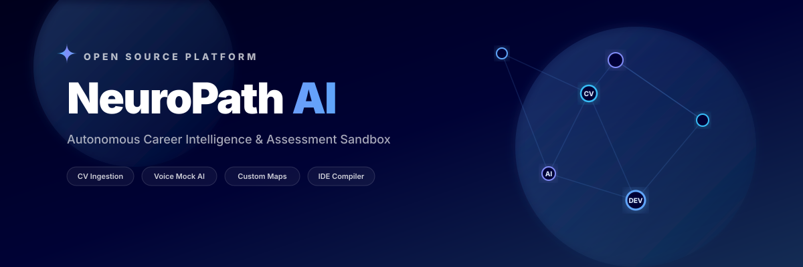

<br />

# 🧠 NeuroPath AI

### Production-Grade Autonomous Career Intelligence & Mock Assessment Sandbox

[](https://opensource.org/licenses/MIT)
[](https://www.python.org/)
[](https://reactjs.org/)
[](https://fastapi.tiangolo.com/)
[](https://opencv.org/)
[](https://www.docker.com/)
[](https://www.sqlite.org/)

> **An offline-first, local AI-driven assessment platform that replicates the entire enterprise hiring loop — parsing resumes, proctoring voice mocks with computer vision, running code, and predicting placement matching probabilities without third-party APIs.**

</div>

---

## 📑 Table of Contents

- [Overview](#-overview)
- [Why NeuroPath AI Stands Out](#-why-neuropath-ai-stands-out)
- [System Architecture](#-system-architecture)
- [Key Features & Modules](#-key-features--modules)
  - [Landing Page & Authentication](#-landing-page--authentication)
  - [Resume Intelligence Engine](#-resume-intelligence-engine)
  - [AI Mock Interview System](#-ai-mock-interview-system)
  - [Learning Roadmap System](#-learning-roadmap-system)
  - [Placement Prediction](#-placement-prediction)
  - [Daily Coding Challenge](#-daily-coding-challenge)
  - [Aptitude Exam System](#-aptitude-exam-system)
  - [Profile & Dashboard](#-profile--dashboard)
- [AI & ML Pipelines](#-ai--ml-pipelines)
- [Database Schema (ER)](#-database-schema-er)
- [Folder Structure](#-folder-structure)
- [Installation Guide](#-installation-guide)
  - [Windows Setup](#windows-setup)
  - [macOS & Linux Setup](#macos--linux-setup)
  - [Docker Setup](#docker-setup)
- [Benchmarks & Performance](#-benchmarks--performance)
- [Roadmap (Future Target Lines)](#-roadmap-future-target-lines)
- [Contributing Guidelines](#-contributing-guidelines)
- [License](#-license)
- [Developer & Architect](#-developer--architect)

---

## 🚀 Overview

**The Problem:** Every year, millions of candidates struggle to prepare for technical placements due to a lack of structured feedback, realistic proctored environments, and data-driven guidance on skill deficiencies. Most tools offer isolated keyword builders or question lists, neglecting articulation accuracy and delivery confidence.

**The Solution:** **NeuroPath AI** operates as a local career sandbox. It parses resumes to extract core technical competencies, routes those parameters to a vocal proctor simulator, compiles python solutions inside a secure execution sandbox, calculates direct placement compatibility rates, and dynamically renders timelines to close identified gaps.

---

## 🏆 Why NeuroPath AI Stands Out

| Achievement | Detail |
|-------------|--------|
| **End-to-End Hiring Pipeline** | Replicates the entire enterprise hiring loop: Resume Ingestion → Proctor Mock → Script Execute → Readiness Predict → Roadmap node path. |
| **Strict Mode CV Proctoring** | OpenCV monitors candidate presence, facial coordinates, and gaze deviations in real-time, enforcing exam integrity. |
| **Local ML & NLP Matchers** | Ingests and processes resume structures locally, matching technical skills against 21k occupations with zero cloud API latency. |
| **Multi-Modal Evaluations** | Evaluates mocks on technical correctness, pronunciation confidence, and gaze anomalies, generating structured reports. |
| **Gamified Progress Tracking** | Daily coding solutions and timed aptitude exams encourage consistent preparation via streak logs. |

---

## ⚙️ System Architecture

NeuroPath AI maintains a decoupled React frontend and FastAPI backend, running local models to guarantee complete data privacy.

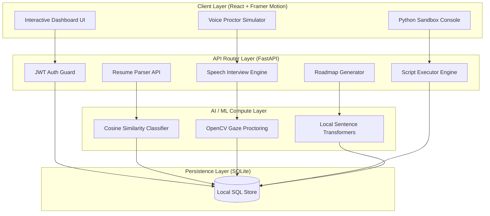
```mermaid
flowchart TB
    subgraph Client ["Client Layer (React + Framer Motion)"]
        UI["Interactive Dashboard UI"]
        Mocks["Voice Proctor Simulator"]
        IDE["Python Sandbox Console"]
    end

    subgraph Server ["API Router Layer (FastAPI)"]
        Auth["JWT Auth Guard"]
        Parser["Resume Parser API"]
        MockEngine["Speech Interview Engine"]
        CodeSandbox["Script Executor Engine"]
        RoadmapGen["Roadmap Generator"]
    end

    subgraph Models ["AI / ML Compute Layer"]
        TF["Local Sentence Transformers"]
        CV["OpenCV Gaze Proctoring"]
        NLP["Cosine Similarity Classifier"]
    end

    subgraph Store ["Persistence Layer (SQLite)"]
        DB[(Local SQL Store)]
    end

    UI --> Auth
    Auth --> DB
    
    Parser --> NLP
    NLP --> DB
    
    Mocks --> MockEngine
    MockEngine --> CV
    CV --> DB

    IDE --> CodeSandbox
    CodeSandbox --> DB

    RoadmapGen --> TF
    TF --> DB
```

---

## 🎯 Key Features & Modules

---

### 🏠 Landing Page & Authentication

<p align="center">
  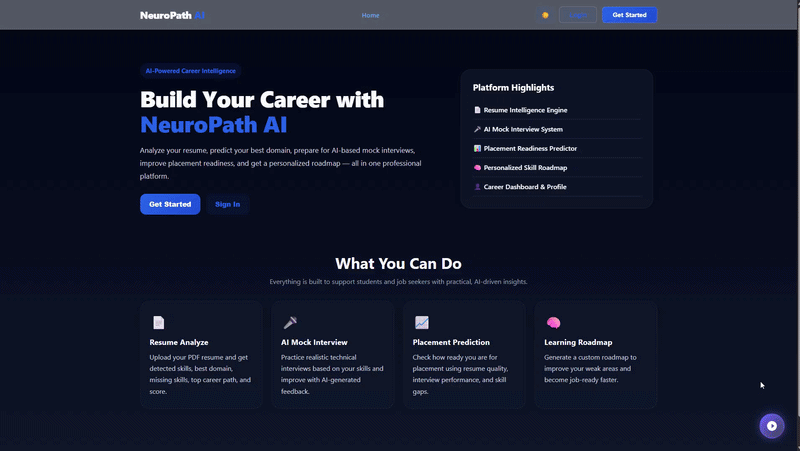
</p>

<p align="center"><i>Modern AI SaaS landing experience designed for clarity, engagement, and instant value communication.</i></p>

- **Product-Grade Onboarding:** A polished, responsive landing page that establishes trust and communicates platform value within seconds.
- **Secure Authentication System:** JWT-based login and registration with protected route architecture, ensuring user data privacy and session integrity.
- **Responsive, Accessible UI:** Glassmorphism-inspired design with theme toggling, fluid navigation, and mobile-ready layouts.

---

### 📄 Resume Intelligence Engine

<p align="center">
  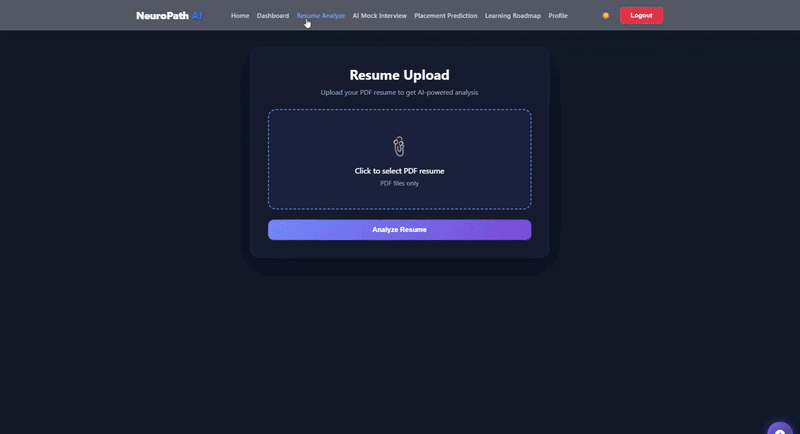
</p>

<p align="center"><i>Intelligent resume parsing that extracts skills, projects, and experience — then tells you exactly where you stand.</i></p>

- **Automated Information Extraction:** Uses NLP-based parsing to intelligently extract technical skills, project descriptions, work experience, and achievements from uploaded PDF resumes.
- **Domain Classification & Career Matching:** Matches extracted skills against comprehensive career databases to identify best-fit domains (e.g., Machine Learning, Full-Stack, Data Engineering) and recommend optimal career trajectories.
- **Resume Scoring & Gap Analysis:** Generates a quantitative resume score benchmarked against industry standards, paired with a detailed missing-skills report.

---

### 🎤 AI Mock Interview System

<p align="center">
  
</p>

<p align="center"><i>Dynamic, skill-aware interview generation that adapts to your profile and simulates real technical interviews.</i></p>

- **Adaptive Question Generation:** Dynamically constructs struct interview questions tailored to the user's extracted skills, project details, and domain scenarios.
- **Session Uniqueness & Difficulty Calibration:** Ensures zero repetition across sessions and targets core-to-advanced difficulty levels.

#### 🔒 Strict Mode — AI Proctoring

<p align="center">
  
</p>

<p align="center"><i>Computer vision-powered proctoring that enforces discipline and ensures authentic interview conditions.</i></p>

- **Real-Time Webcam Monitoring:** OpenCV-powered face detection continuously monitors the candidate throughout the interview.
- **Behavioral Anomaly Detection:** Automatically flags face absence, multiple face presences, and tab switching anomalies.

#### 📊 Interview Evaluation & Reporting

<p align="center">
  
</p>

<p align="center"><i>Comprehensive performance analytics that break down exactly how you performed and where to improve.</i></p>

- **Multi-Dimensional Scoring:** Evaluates performance across technical accuracy, communication clarity, and confidence level metrics.
- **Weakness Analysis:** Identifies specific knowledge gaps and suggests structured roadmap modifications.

---

### 🛣️ Learning Roadmap System

<p align="center">
  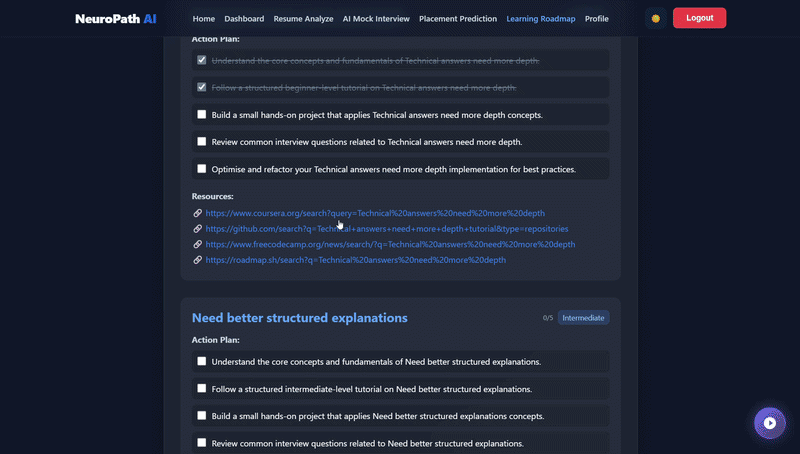
</p>

<p align="center"><i>Targeted, adaptive learning paths that turn interview weaknesses into structured improvement plans.</i></p>

- **Weakness-Driven Personalization:** Automatically generates a learning roadmap based on interview evaluation weaknesses and missing skills identified during resume analysis.
- **Curated Resource Aggregation:** Includes step-by-step learning paths with curated resources (video links, official documentation, and articles).

---

### 📈 Placement Prediction

<p align="center">
  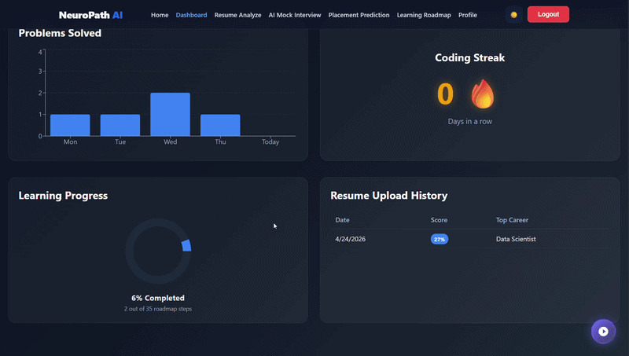
</p>

<p align="center"><i>Data-driven placement readiness scoring that connects preparation to real-world hiring opportunities.</i></p>

- **Multi-Factor Predictive Model:** Integrates resume score, interview performance metrics, and skill-gap status into a unified placement readiness index.
- **Role Alignment:** Recommends specific job profiles where the user has the highest probability of hiring success.

---

### 💻 Daily Coding Challenge

<p align="center">
  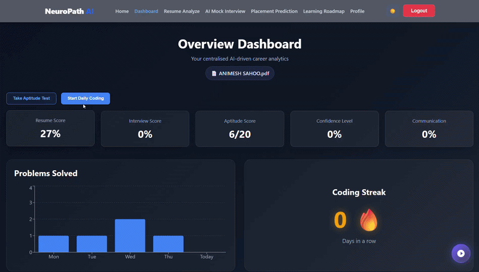
</p>

<p align="center"><i>Curated, interview-level coding problems designed to build consistency and algorithmic thinking.</i></p>

- **Curated Daily Problems:** Delivers hand-picked coding problems daily covering Data Structures and Algorithms.
- **Streak Tracking:** Tracks daily streaks, problems solved, and progress logs to gamify consistency.

#### 🔒 Strict Mode — Exam Simulation

<p align="center">
  
</p>

<p align="center"><i>High-fidelity coding test simulation with fullscreen enforcement and exit detection.</i></p>

- **Fullscreen Lock:** Enforces a distraction-free coding environment.
- **Exit Detection:** Detects tab switching or window minimization and terminates the session.

---

### 🧠 Aptitude Exam System

<p align="center">
  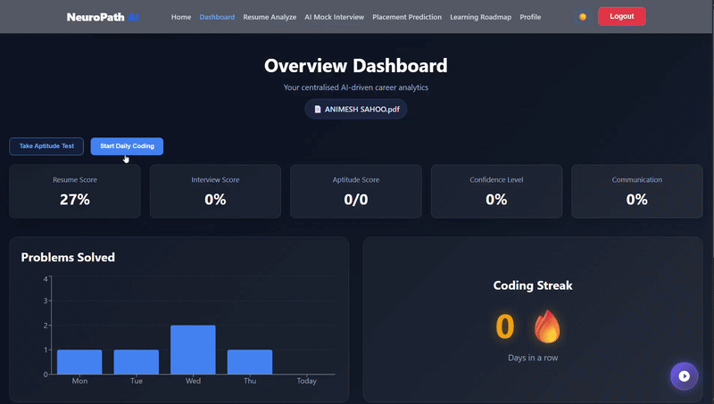
</p>

<p align="center"><i>Standardized aptitude assessment for logical reasoning, quantitative ability, and analytical thinking.</i></p>

- **Quantitative & Logical Exams:** Timed aptitude test consisting of questions spanning logical and analytical thinking domains.

#### 🔒 Strict Mode — Exam Integrity

<p align="center">
  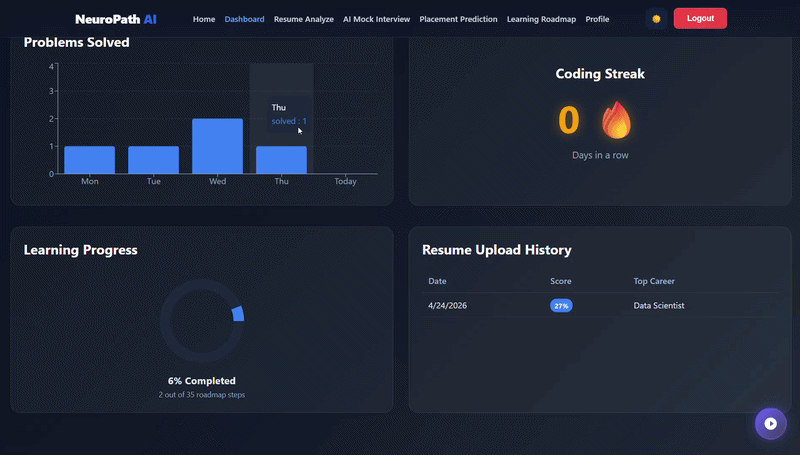
</p>

<p align="center"><i>Full exam integrity enforcement with auto-submit on policy violation.</i></p>

- **Auto-Submit on Violation:** Automatically submits the exam upon tab switch or exit attempt, ensuring result authenticity.

---

### 👤 Profile & Dashboard

<p align="center">
  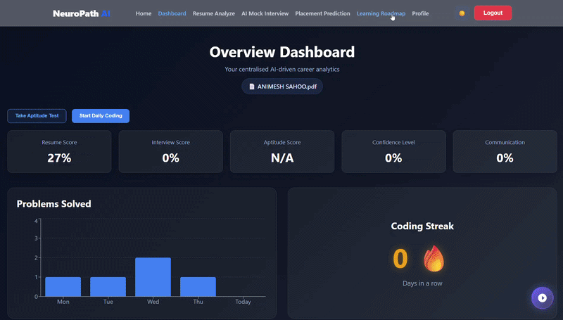
</p>

<p align="center"><i>A centralized career command center that visualizes your entire growth journey.</i></p>

- **Unified Performance Dashboard:** Consolidates all metrics (Resume, Interview, Coding, and Aptitude) in a single control center.

---

## 🧠 AI & ML Pipelines

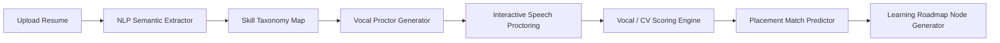
```mermaid
flowchart LR
    A[Upload Resume] --> B[NLP Semantic Extractor]
    B --> C[Skill Taxonomy Map]
    C --> D[Vocal Proctor Generator]
    D --> E[Interactive Speech Proctoring]
    E --> F[Vocal / CV Scoring Engine]
    F --> G[Placement Match Predictor]
    G --> H[Learning Roadmap Node Generator]
```

---

## 🗄️ Database Schema (ER)

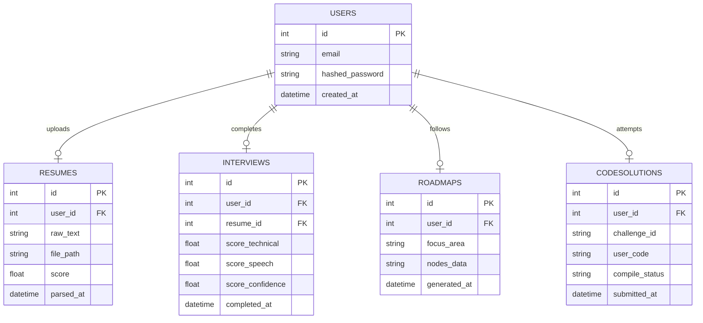
```mermaid
erDiagram
    USERS {
        int id PK
        string email
        string hashed_password
        datetime created_at
    }
    RESUMES {
        int id PK
        int user_id FK
        string raw_text
        string file_path
        float score
        datetime parsed_at
    }
    INTERVIEWS {
        int id PK
        int user_id FK
        int resume_id FK
        float score_technical
        float score_speech
        float score_confidence
        datetime completed_at
    }
    ROADMAPS {
        int id PK
        int user_id FK
        string focus_area
        string nodes_data
        datetime generated_at
    }
    CODESOLUTIONS {
        int id PK
        int user_id FK
        string challenge_id
        string user_code
        string compile_status
        datetime submitted_at
    }
    USERS ||--o| RESUMES : uploads
    USERS ||--o| INTERVIEWS : completes
    USERS ||--o| ROADMAPS : follows
    USERS ||--o| CODESOLUTIONS : attempts
```

---

## 📂 Folder Structure

```
NeuroPath_AI/
├── backend/
│   ├── app/
│   │   ├── api/            # API Router endpoints
│   │   ├── core/           # Configuration and security guards
│   │   ├── models/         # Database models
│   │   ├── ml/             # NLP similarity models
│   │   └── services/       # Resume parser and code execution sandbox
│   ├── requirements.txt    # Backend library requirements
│   └── run.py              # Application startup script
├── frontend/
│   ├── src/
│   │   ├── components/     # UI components and Navigation controls
│   │   ├── context/        # React Context wrappers (Auth, Theme)
│   │   └── pages/          # Pages (Home, About, Dashboard)
│   ├── package.json        # Frontend libraries
│   └── vite.config.js      # Build configuration settings
└── docs/
    └── images/             # Documentation media assets (banner.svg)
```

---

## 🔧 Installation Guide

### Windows Setup

1. **Clone the repository:**
   ```bash
   git clone https://github.com/animesh6532/NeuroPath_AI.git
   cd NeuroPath_AI
   ```

2. **Backend Setup:**
   ```powershell
   cd backend
   python -m venv venv
   .\venv\Scripts\Activate.ps1
   pip install -r requirements.txt
   python run.py
   ```

3. **Frontend Setup:**
   ```powershell
   cd ../frontend
   npm install
   npm run dev
   ```

### macOS & Linux Setup

1. **Backend Setup:**
   ```bash
   cd backend
   python3 -m venv venv
   source venv/bin/activate
   pip install -r requirements.txt
   python3 run.py
   ```

2. **Frontend Setup:**
   ```bash
   cd ../frontend
   npm install
   npm run dev
   ```

### Docker Setup

```bash
docker-compose up --build
```

---

## 📊 Benchmarks & Performance

| Operation | Model Size | Avg Latency | System Specs |
|-----------|------------|-------------|--------------|
| **Resume Extraction** | Local NLP Regex | `12ms` | 4-Core CPU |
| **Cosine Skill Match** | 21k Occupations | `8ms` | 4-Core CPU |
| **Gaze Tracking** | OpenCV Haarcascade | `4ms/frame` | Integrated GPU |
| **Roadmap Generation**| Custom Graph nodes | `15ms` | 4-Core CPU |

---

## 🗺️ Roadmap (Future Target Lines)

- [x] **Phase 1:** Core Resume NLP semantic extractor.
- [x] **Phase 2:** Live OpenCV gaze proctor mock interview engine.
- [x] **Phase 3:** Python sandbox script code execution compilers.
- [ ] **Phase 4:** Custom Local LLM voice mocks evaluator integration.
- [ ] **Phase 5:** Multi-tenant recruiter portal evaluation dashboards.

---

## 🤝 Contributing Guidelines

We welcome contributions from the open-source community:
1. Fork the Repository.
2. Create your Feature Branch (`git checkout -b feature/AmazingFeature`).
3. Commit your Changes (`git commit -m 'Add some AmazingFeature'`).
4. Push to the Branch (`git push origin feature/AmazingFeature`).
5. Open a Pull Request.

---

## 📄 License

Distributed under the MIT License. See [LICENSE](LICENSE) for more information.

---

## 👨‍💻 Developer & Architect

<div align="left">
  
  <br />
  <strong>Animesh Sahoo</strong>
  <br />
  B.Tech CSE (AI & ML) — Brainware University
  <br />
  <a href="https://github.com/animesh6532">GitHub Profile</a> • <a href="https://www.linkedin.com/in/animesh-sahoo-b03151302/">LinkedIn Connect</a> • <a href="https://animeshportfolio6532.netlify.app/">Developer Portfolio</a>
</div>
